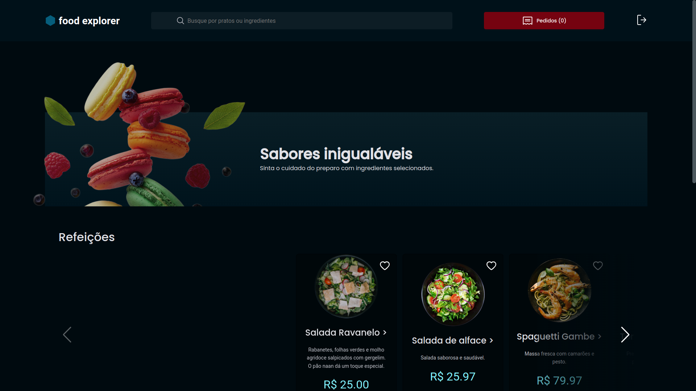

# Food Explorer-API


API developed for a fictitious restaurant, where there are two personas, the admin and the user.

The admin can create, view, edit, and delete a dish at any time. Each dish contains an image, a name, a category, a brief description, the ingredients, and its price.

The user can create an account and authenticate using JWT authentication, which is validated with a password, search for dishes by their name or by the ingredients of the dish and when they click on a dish, they will be redirected to a new screen with more detailed information about it.


## Screenshots




## Stack

**Front-end:** ReactJs, Styled-Components

**Back-end:** NodeJs, ExpressJs, KnexJs.


## 

Clone the project

```bash
  git clone https://github.com/nskntc/Food-Explorer-API
```

Navigate to the project directory

```bash
  cd Food-Explorer-API
```

Install the dependencies

```bash
  npm install
```

Start the server

```bash
  npm run dev
```


## Environment variables

To run this project, you can add the following environment variables to your .env file.

`AUTH_SECRET`

`PORT`


## Admin Account

E-mail: admin@gmail.com

Password: admin


## Deploy

Frontend: https://food-explorer-nicolas.netlify.app/

Backend: https://food-explorer-api-nicolas.onrender.com


## Frontend repository

https://github.com/nskntc/Food-Explorer